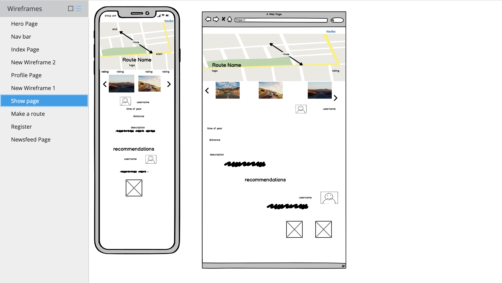
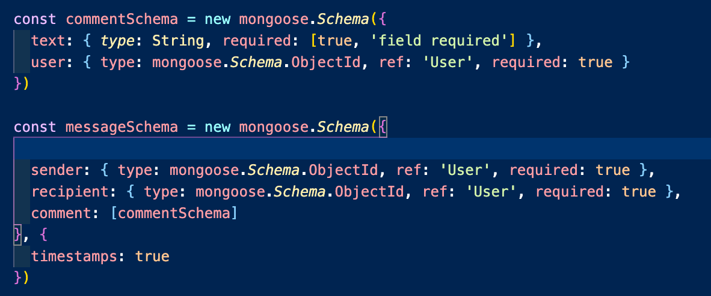
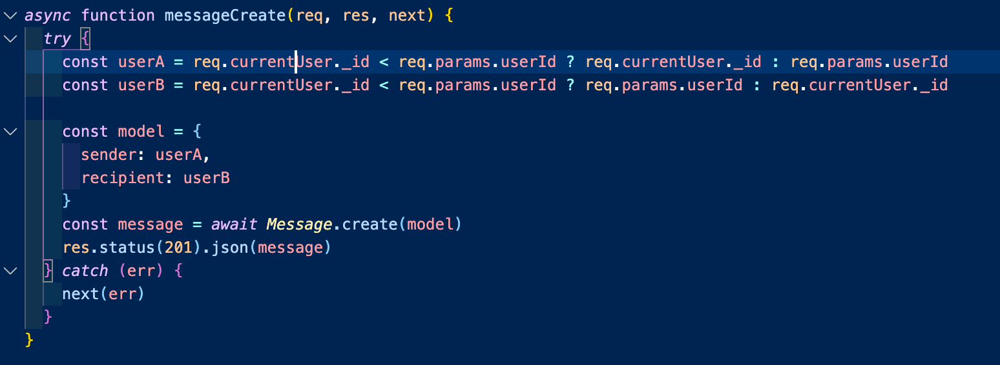
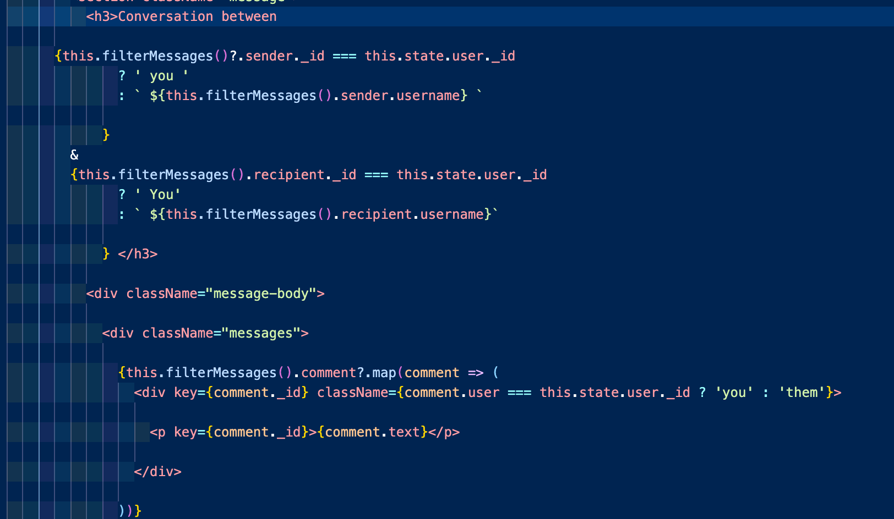
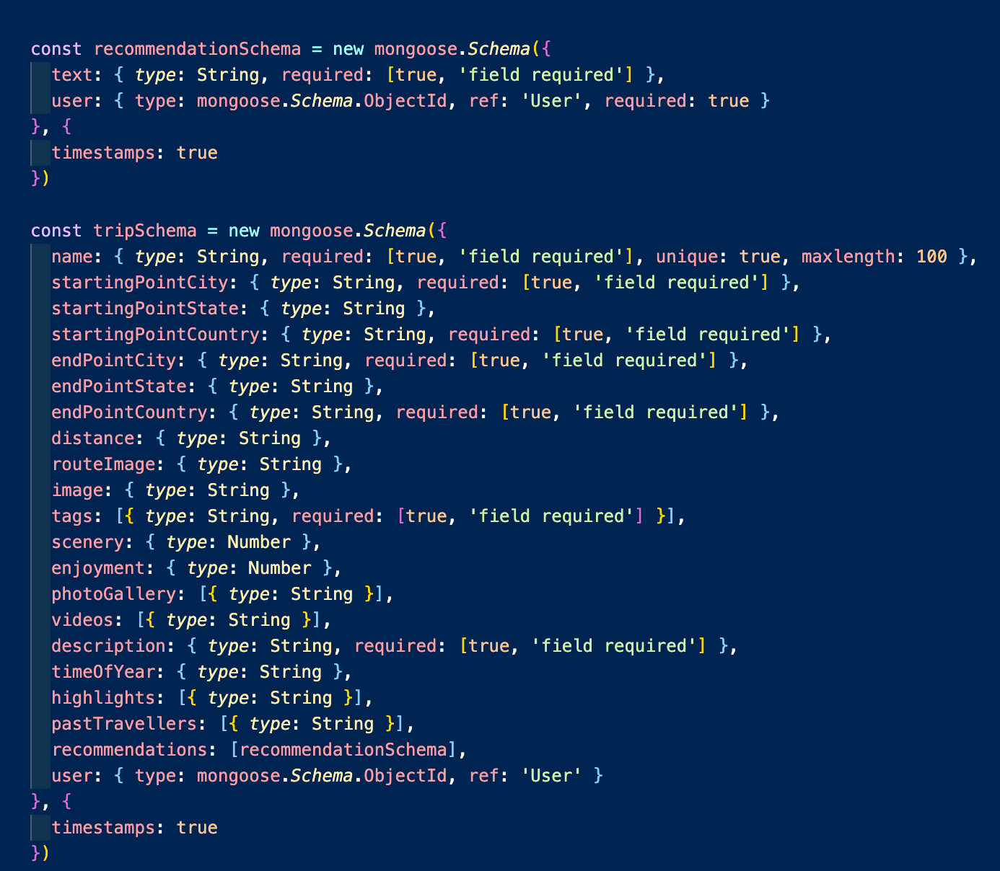
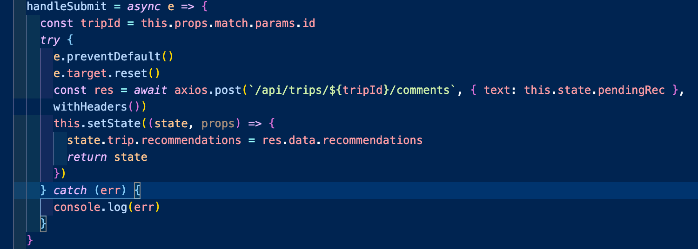
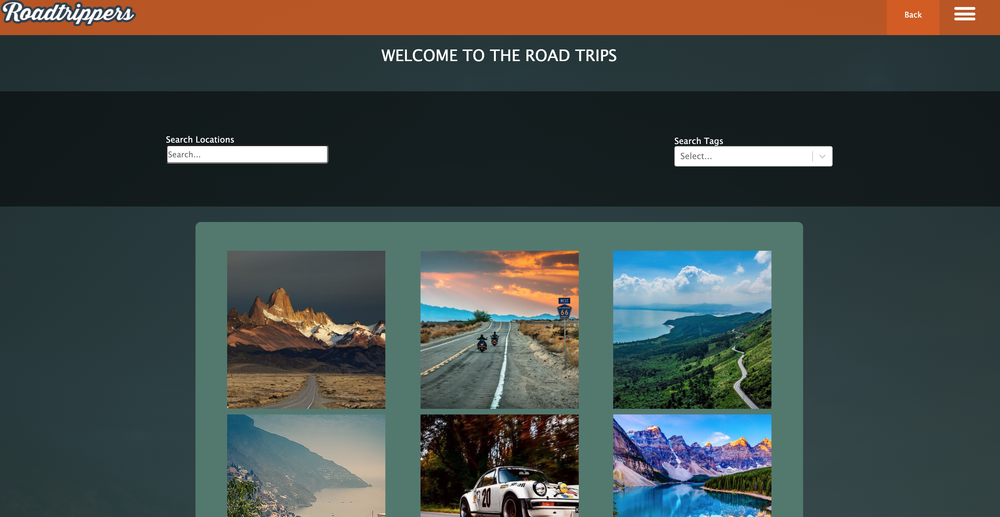
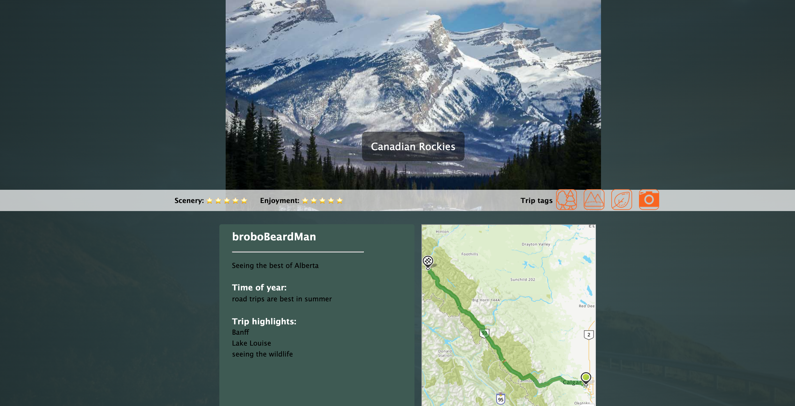
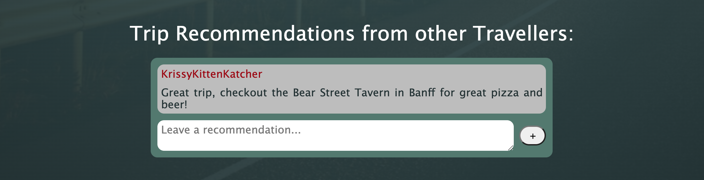
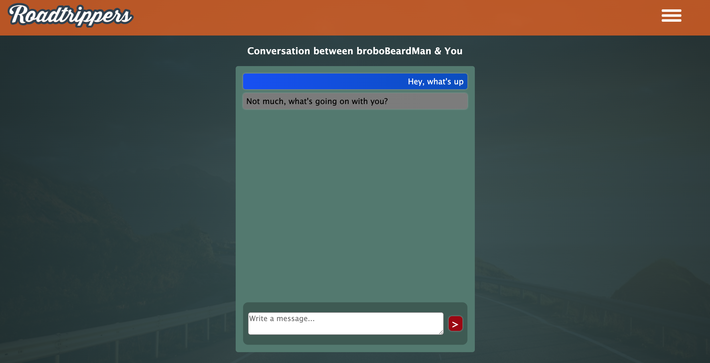

# Roadtrippers

This project was developed as part of General Assembly's Software Engineering Immersive. This project is a full-stack web application that was completed in a group of 3 over 8 days. Some additional bugs were fixed after the project was handed in.

Please be aware there may be a delay in the initial loading of the website, this is because Heroku puts the dyno running our application to sleep when there is no traffic. 

## Brief

Road Trippers is a social media site where users can create an account to share road trips with photos as well as give each other recommendations and send messages.

## Technologies Used

* Node.js
* MongoDB
* Mongoose
* React.js
* JavaScript(ES6) / HTML5
* SCSS
* Express.js
* Yarn package manager
* Axios
* Json Web Tokens
* Git
* GitHub
* Heroku

## Approach

* We decided to go for a feature heavy approach, aspiring to implement interactive maps, picture tags, messaging, recommendation etc. We wanted to be ambitious at the start of the project, as we know as long as MVP had been reached by the due date any features that were not completed could be cut from the project. We achieved most of what we originally set out to do, though one big feature we would have liked to implement would have been a news feed and we did not have time for this.

* To start off the planning, we designed wireframes on Balsamiq in order to create the style and map out the user flow. This helped structure to our development process, as we knew what components we would create in the front end as well as the information we would need to display which helped us make the backend models and routes.

* In order to stay on top of how the project was going, we would have regular stand ups to start and end the day, as well as after lunch. We would say what we had done, and what we were going to do. We could also ask any questions, and if someone wasn't sure what to work on next we could decide this as a group.

## Process

* For styling, we decided not to use a framework, and instead used SCSS along with some packages to solve some of our bigger styling tasks, such as React Responsive Carousel to display the images and React Burger Menu for the sidebar navigation. We decided to use a bold, rugged colour palette on the project using the Yukon 1000 (https://www.yukon1000.org/) site for inspiration.

* We made a priority list for the features we wanted to implement, and each took ownership of the features we were most interested in. While it would have been better to collaboratively work on the features together in order to best share knowledge, we were concious of how little time we had to effectively deploy our goal site. We also had a deadline in mind to freeze any features that were not completed in time, so that we would still have a day to work on styling, seeds files and any remaining bugs.

* I worked on the back end, making the models and routes and testing them using Insomnia. On the front end I worked on implementing the messaging and the recommendations, as well as the search bar on the show page, and made some of the components (eg show page). My other teammates worked on the styling for the project, the profile page, nav bar, and the trip tags/user preferences using SVG files.

The messages consist of 2 models, one is the overarching message schema, and attached to that are the comments each person in the conversation makes. I was inspired to make it this way by thinking about how the threads in Slack work and then adapting it to our needs:

In order to make the messages easy to locate for each user, the user and sender were standerdised by adding logic to the controller:

On the frontend, in order to make the conversations tailored to each user, I have used a ternary statement to add some logic to determine which messages belong to the user viewing the conversation. This means the user will not see their own username at the top of the conversation, instead they'll see 'you' and the messages they send will be given a class styled similarly to Facebook messanger with their own messages appearing on the right side in blue. An example of the messages can be see in the section below.

The recommendations are attached to a trip model, and contain some text and the user that sent the recommendation:

On the front end, in order for new recommendations to show up as soon as the user hits submit, I used a setState Updater Function. I also used a similar function to this for the messages. An example of the recommendations can be seen in the section below:

### Website Examples

The home page shows our colour scheme and off-centre style:

Users can search trips by location or by tags:

The trips page displays photos, information about the trip and an interactive map:

An example of the recommendations that users can leave on each others trips:

Users can have their own profile page displaying photos, which also links to their messages:

An example of the messaging feature:

## Key Learnings

This project was a great opportunity to learn how to work on a large project with other people, and manage the challenges that is came with. 

One of these challanges was version control, this was the first time for the class that we were in a group situation where this issue came up and we had to learn and adapt quickly. We used a development branch off the master branch in order to keep our work while the project was still being worked on, and used our own branches for the specific features we were working on, merging into the development branch regularly. Any merge conflicts were dealt with as a team if we did not know which version should be kept.

We all managed to work well together, and could effectively communicate when it came to asking for help and dividing up work.

## Challenges and Wins

Implementing the messaging feature was the biggest challenge I had during this project. I went through multiple iterations of the back end model until I designed one that met the requirements we had for the feature - with an overarching conversation model and individual messages attached to it. Then it was also challenging getting the conversations to work on the front end with the additional styling based on who is viewing the conversation (the sender or receiver of the messages).

Working on this project really solidified my understanding of the relationship between the front end and back end, making the models on the back end and then populating the information on the front end. I feel like I have gained a better overall understanding on how to make a full stack application.

## Future Improvements

* The ability to search for users by username and trip preferences
* News feed where people can share posts about the trips they are on.
* Images and maps in the recommendations.

## Deployment

This project was deployed using Heroku:
https://road-trip-ga.herokuapp.com/

## Bugs

* You can create multiple conversations with the same other user
* Images of different heights do not fit in the image carousels well, as smaller images appear with lots of blank space and larger photos either warp the size of the carousel or appear super blurry.
* The maps created using the Qap Quest API do not always match the routes described, this appears to be the API priortitising the fastest routes, which are not always the best road trip routes. 
